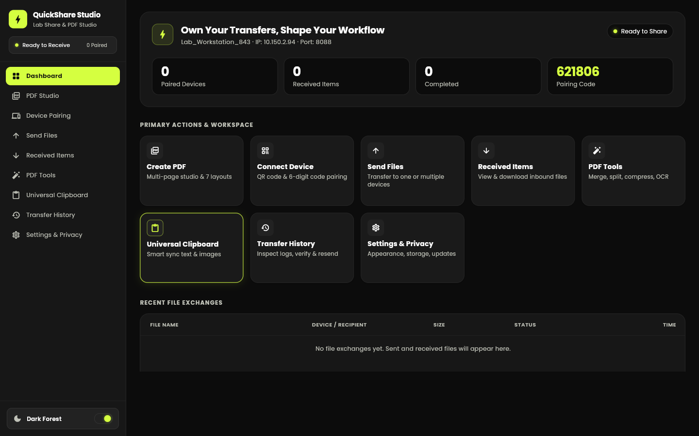

<div align="center">

# QuickShare Studio

**Cross-platform file sharing, universal clipboard and PDF studio for labs, classrooms and developers.**

[](https://github.com/abhijeetmahakur/QuickShareStudio/actions/workflows/ci.yml)
[](https://github.com/abhijeetmahakur/QuickShareStudio/releases/latest)
[](LICENSE)
[](https://flutter.dev)

[Download](#-download--install) · [Features](#-features) · [Build from source](#-build-from-source) · [Contributing](#-contributing)



</div>

---

## Overview

QuickShare Studio turns a pile of screenshots into a clean, print-ready PDF in a few clicks, and gives you the tools around it: merging, splitting and compressing PDFs, a universal clipboard, and pairing with your other devices by QR code or 6-digit code.

Everything runs locally on your machine. No account, no cloud upload.

## ✨ Features

| Area | What you get |
|---|---|
| **PDF Studio** | Three-panel editor (pages · live preview · layout controls) with 1, 2, 3, 4, 6, 8 and 10 images per page or a custom grid; A3/A4/A5/Letter paper; printer-safe margins; borders, captions, headers/footers and page numbers; optional searchable OCR text layer. |
| **PDF Tools** | Merge, split by page ranges, and compress (72 / 150 / 300 DPI profiles); file converter with whole-folder support. |
| **Save, print & share** | Exports save straight to `Downloads/QuickShare`; *Print / Preview* opens the file in your system PDF viewer; *Share* opens the OS share sheet. |
| **Device pairing** | Expiring 6-digit codes and QR pairing; the code regenerates on demand and old codes are invalidated. |
| **File sharing** | Send to one or several paired devices with progress, pause/resume and SHA-256 integrity checks. |
| **Screenshot sessions** | Group screenshots per lab or experiment, with duplicate detection and drag-and-drop reordering. |
| **Universal clipboard** | Text, links, code and images, previewed before anything is sent. |
| **Privacy & security** | PIN lock, private mode, configurable download folder and one-click cache purge. |

> **Project status:** PDF Studio, PDF Tools and file export are fully functional. Live device-to-device transfer over the local network is under active development; in the desktop packages, pairing and transfers currently run in a local demonstration mode.

---

## 📥 Download & Install

Pre-built packages are published on the **[Releases page](https://github.com/abhijeetmahakur/QuickShareStudio/releases/latest)**.

| Platform | Package | Requirements |
|---|---|---|
| 🪟 **Windows 10/11** | `QuickShareStudio-Windows-x64.zip` | [Python 3.10+](https://www.python.org/downloads/), Google Chrome or Microsoft Edge |
| 🐧 **Linux** (x64) | `QuickShareStudio-Linux.tar.gz` | Python 3, Google Chrome / Chromium / Edge |
| 🤖 **Android** | `QuickShareStudio-Android.apk` | Permission to install apps from your browser/file manager |
| 🍎 **iOS / iPadOS** | Build from source (see below) | A Mac with Xcode |

### 🪟 Windows

1. Install **Python 3.10 or newer** from [python.org](https://www.python.org/downloads/). On the first installer screen, tick **"Add python.exe to PATH"**.
2. Download **`QuickShareStudio-Windows-x64.zip`** from the [latest release](https://github.com/abhijeetmahakur/QuickShareStudio/releases/latest).
3. Right-click the zip → **Extract All…** and choose a permanent folder, for example `C:\Apps\QuickShareStudio`.
4. Open the extracted folder and double-click **`launch.vbs`**. QuickShare Studio opens in its own app window.

**Optional: install with Start Menu & Desktop shortcuts.** Clone the repository and run the installer script from PowerShell. It builds the app and registers it under *Settings → Apps → Installed apps* (requires the [Flutter SDK](https://docs.flutter.dev/get-started/install/windows)):

```powershell
git clone https://github.com/abhijeetmahakur/QuickShareStudio.git
cd QuickShareStudio
powershell -ExecutionPolicy Bypass -File .\scripts\install_quickshare.ps1
```

To uninstall, use *Settings → Apps → Installed apps → QuickShare Studio → Uninstall*.

### 🐧 Linux

```bash
# 1. Prerequisites (Debian/Ubuntu shown; use your distro's package manager otherwise)
sudo apt install python3 chromium      # or install Google Chrome

# 2. Download and extract the latest release
wget https://github.com/abhijeetmahakur/QuickShareStudio/releases/latest/download/QuickShareStudio-Linux.tar.gz
tar -xzf QuickShareStudio-Linux.tar.gz
cd QuickShareStudio-Linux

# 3. Launch
./launch.sh
```

Exported files are saved to `~/Downloads/QuickShare`. To add a menu entry, create a desktop launcher that runs the full path to `launch.sh`.

### 🤖 Android

1. On your phone, open the [latest release](https://github.com/abhijeetmahakur/QuickShareStudio/releases/latest) and download **`QuickShareStudio-Android.apk`**.
2. Open the downloaded file. If prompted, allow your browser or file manager to **install unknown apps** (*Settings → Apps → Special app access → Install unknown apps*).
3. Tap **Install**, then **Open**.

> Because the app is distributed outside the Google Play Store, Google Play Protect may show a warning on first install. Choose **More details → Install anyway**.

### 🍎 iOS / iPadOS

Apple only allows signed apps on iPhone and iPad, so there is no downloadable `.ipa`. You can install QuickShare Studio on your own device from source:

1. On a Mac, install [Xcode](https://apps.apple.com/app/xcode/id497799835) and the [Flutter SDK](https://docs.flutter.dev/get-started/install/macos).
2. Clone and prepare the project:
   ```bash
   git clone https://github.com/abhijeetmahakur/QuickShareStudio.git
   cd QuickShareStudio
   flutter pub get
   open ios/Runner.xcworkspace
   ```
3. In Xcode, select the **Runner** target → **Signing & Capabilities**, choose your Apple ID team, and set a unique bundle identifier.
4. Connect your iPhone/iPad, select it as the run destination, and press **Run** (▶).
5. On the device, trust the developer certificate under *Settings → General → VPN & Device Management*.

> With a free Apple ID, apps installed this way must be re-installed every 7 days; a paid Apple Developer account removes that limit.

---

## 🛠 Build from source

**Prerequisites:** [Flutter SDK 3.47+](https://docs.flutter.dev/get-started/install) (Dart 3.13+), Git, and Python 3 for the desktop launcher.

```bash
git clone https://github.com/abhijeetmahakur/QuickShareStudio.git
cd QuickShareStudio
flutter pub get
```

| Target | Command | Output |
|---|---|---|
| Desktop web bundle (Windows/Linux packages) | `flutter build web --release --wasm --no-web-resources-cdn` | `build/web/` |
| Android APK | `flutter build apk --release` | `build/app/outputs/flutter-apk/app-release.apk` |
| iOS | `flutter build ios --release` | `build/ios/iphoneos/Runner.app` |

Run the desktop bundle locally:

```bash
python scripts/server.py build/web      # then open the printed http://127.0.0.1:<port>
```

### Development

```bash
flutter run -d chrome      # hot reload while you edit lib/
flutter analyze            # static analysis
flutter test               # unit & widget tests
```

On Windows, `QuickShareDev.bat` starts a live-reload development session. See [DEV_WORKFLOW.md](DEV_WORKFLOW.md) for details.

### Publishing a release

Releases are built automatically by GitHub Actions ([`.github/workflows/release.yml`](.github/workflows/release.yml)). Push a version tag and the Windows, Linux and Android packages are attached to a new GitHub Release:

```bash
git tag v1.6.0
git push origin v1.6.0
```

---

## 🧱 Architecture

| Layer | Technology |
|---|---|
| UI | Flutter (Material 3), WebAssembly renderer on desktop |
| State | `provider` with a central `TransferEngine` |
| PDF | `pdf` for generation, `printing` for rasterising and previews |
| Storage | `shared_preferences`; files saved via a local helper server (`scripts/server.py`) on desktop |
| Integrity | `crypto` (SHA-256), `uuid` |

```
lib/
├── app/            # App shell, navigation, theme
├── core/           # Constants, services (file actions, theme), utilities, shared widgets
├── data/           # Models and services (TransferEngine, cross-device transfer, updates)
└── features/       # dashboard · pdf_editor · pdf_layout · pdf_tools · pairing · file_transfer
                    # received_items · screenshot_collections · clipboard · transfer_history · security
scripts/            # Desktop launcher, local file server, installer, dev tooling
```

## 🤝 Contributing

1. Fork the repository and create a branch: `git checkout -b feature/my-change`.
2. Make your change and keep `flutter analyze` and `flutter test` passing.
3. Open a pull request describing what changed and why.

Bug reports and feature requests are welcome in [Issues](https://github.com/abhijeetmahakur/QuickShareStudio/issues).

## 📄 License

Released under the [MIT License](LICENSE). © 2026 Abhijeet Mahakur.
