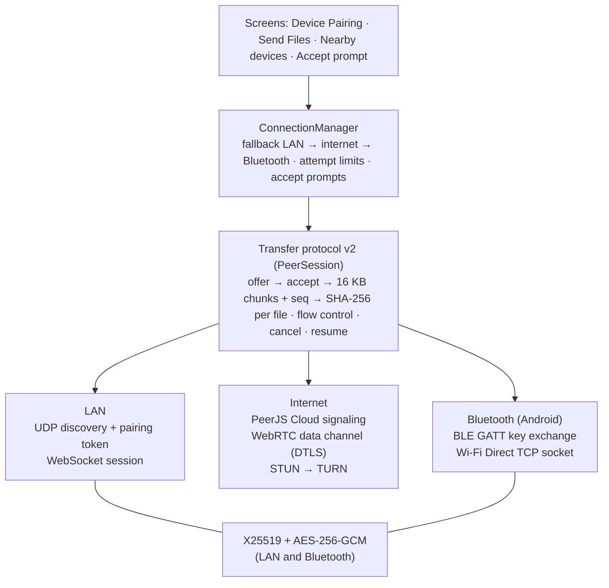

<div align="center">

# QuickShare Studio

**Cross-platform file sharing, universal clipboard and PDF studio for labs, classrooms and developers.**

[](https://github.com/abhijeetmahakur/QuickShareStudio/actions/workflows/ci.yml)
[](https://github.com/abhijeetmahakur/QuickShareStudio/releases/latest)
[](LICENSE)
[](https://flutter.dev)

[Download](#-download--install) · [Features](#-features) · [Build from source](#-build-from-source) · [Contributing](#-contributing)


</div>

---

## Overview

QuickShare Studio turns a pile of screenshots into a clean, print-ready PDF in a few clicks, and gives you the tools around it: merging, splitting and compressing PDFs, a universal clipboard, and pairing with your other devices by QR code or 6-digit code.

No account and no cloud storage: files go directly from one device to the other, end-to-end encrypted, on the same Wi-Fi, over the internet, or over Bluetooth.

## ✨ Features

| Area | What you get |
|---|---|
| **PDF Studio** | Three-panel editor (pages · live preview · layout controls) with 1, 2, 3, 4, 6, 8 and 10 images per page or a custom grid; A3/A4/A5/Letter paper; printer-safe margins; borders, captions, headers/footers and page numbers; optional searchable text layer from captions. Work is kept while you switch sections. |
| **PDF Tools** | Lossless merge and split (pages are copied, not re-rendered, so text stays selectable and files stay small); compression (72 / 100 / 150 DPI JPEG profiles); OCR for screenshots and scanned PDFs (English, Hindi) with text export and searchable-PDF output; file converter with whole-folder support. |
| **Save, print & share** | Exports save straight to `Downloads/QuickShare`; *Print / Preview* opens the file in your system PDF viewer; *Share* opens the OS share sheet. |
| **Connect devices** | One 6-digit code (or QR code) works three ways: **same Wi-Fi**, **over the internet** (different networks; WebRTC with a TURN relay fallback) and **Bluetooth** (Android 10+, no network needed). QuickShare tries the Wi-Fi first and falls back automatically. Codes work once and expire after 5 minutes. |
| **File sharing** | Send any number of files of any size. The receiver sees who is sending what and taps **Accept** first. Transfers are end-to-end encrypted, show progress, speed and time left, can be cancelled, resume after a dropped connection, and every file is verified with SHA-256. |
| **Screenshot sessions** | Group screenshots per lab or experiment (sidebar → *Screenshot Sessions*), with duplicate detection and drag-and-drop reordering. |
| **Universal clipboard** | Text, links, code and images, previewed before anything is sent. |
| **Privacy & security** | PIN lock, private mode, configurable download folder and one-click cache purge. |
| **Updates** | Checks GitHub Releases at launch; Android and the desktop app download, verify and install new versions themselves. |

> **Works offline:** PDF tools, OCR (English and Hindi), printing, same-Wi-Fi and Bluetooth sharing need no internet connection. Only internet transfers and update checks go online.

---

## 📥 Download & Install

Pre-built packages are published on the **[Releases page](https://github.com/abhijeetmahakur/QuickShareStudio/releases/latest)**.

| Platform | Package | Requirements |
|---|---|---|
| 🪟 **Windows 10/11** | `QuickShareStudio-Windows-x64.zip` | [Python 3.10+](https://www.python.org/downloads/), Google Chrome or Microsoft Edge |
| 🐧 **Linux** (x64) | `QuickShareStudio-Linux.tar.gz` | Python 3, Google Chrome / Chromium / Edge |
| 🤖 **Android** | `QuickShareStudio-Android.apk` | Permission to install apps from your browser/file manager |
| 🍎 **iOS / iPadOS** | Build from source (see below) | A Mac with Xcode |
| 🌐 **Web / PWA** | Install via browser (Chrome / Edge / Safari) | Any modern browser with PWA support |

> [!NOTE]
> **PWA App Icon Refresh:** Web browsers aggressively cache PWA installation manifests and icons. If you have an already-installed copy of QuickShare Studio on your device, it must be uninstalled and reinstalled to refresh the cached home screen icon, app switcher icon, and splash screen with the new logo.

### 🪟 Windows

1. Install **Python 3.10 or newer** from [python.org](https://www.python.org/downloads/). On the first installer screen, tick **"Add python.exe to PATH"**.
2. Download **`QuickShareStudio-Windows-x64.zip`** from the [latest release](https://github.com/abhijeetmahakur/QuickShareStudio/releases/latest).
3. Right-click the zip → **Extract All…** and choose a permanent folder, for example `C:\Apps\QuickShareStudio`.
4. Open the extracted folder and double-click **`launch.vbs`**. QuickShare Studio opens in its own app window.

**Optional: install with Start Menu & Desktop shortcuts.** Clone the repository and run the installer script from PowerShell. It builds the app and registers it under *Settings → Apps → Installed apps* (requires the [Flutter SDK](https://docs.flutter.dev/get-started/install/windows)):

```powershell
git clone https://github.com/abhijeetmahakur/QuickShareStudio.git
cd QuickShareStudio
powershell -ExecutionPolicy Bypass -File .\scripts\install_quickshare.ps1
```

To uninstall, use *Settings → Apps → Installed apps → QuickShare Studio → Uninstall*.

### 🐧 Linux

```bash
# 1. Prerequisites (Debian/Ubuntu shown; use your distro's package manager otherwise)
sudo apt install python3 chromium      # or install Google Chrome

# 2. Download and extract the latest release
wget https://github.com/abhijeetmahakur/QuickShareStudio/releases/latest/download/QuickShareStudio-Linux.tar.gz
tar -xzf QuickShareStudio-Linux.tar.gz
cd QuickShareStudio-Linux

# 3. Launch
./launch.sh
```

Exported files are saved to `~/Downloads/QuickShare`. To add a menu entry, create a desktop launcher that runs the full path to `launch.sh`.

### 🤖 Android

1. On your phone, open the [latest release](https://github.com/abhijeetmahakur/QuickShareStudio/releases/latest) and download **`QuickShareStudio-Android.apk`**.
2. Open the downloaded file. If prompted, allow your browser or file manager to **install unknown apps** (*Settings → Apps → Special app access → Install unknown apps*).
3. Tap **Install**, then **Open**.

> Because the app is distributed outside the Google Play Store, Google Play Protect may show a warning on first install. Choose **More details → Install anyway**.

### 🍎 iOS / iPadOS

Apple only allows signed apps on iPhone and iPad, so there is no downloadable `.ipa`. You can install QuickShare Studio on your own device from source:

1. On a Mac, install [Xcode](https://apps.apple.com/app/xcode/id497799835) and the [Flutter SDK](https://docs.flutter.dev/get-started/install/macos).
2. Clone and prepare the project:
   ```bash
   git clone https://github.com/abhijeetmahakur/QuickShareStudio.git
   cd QuickShareStudio
   flutter pub get
   open ios/Runner.xcworkspace
   ```
3. In Xcode, select the **Runner** target → **Signing & Capabilities**, choose your Apple ID team, and set a unique bundle identifier.
4. Connect your iPhone/iPad, select it as the run destination, and press **Run** (▶).
5. On the device, trust the developer certificate under *Settings → General → VPN & Device Management*.

> With a free Apple ID, apps installed this way must be re-installed every 7 days; a paid Apple Developer account removes that limit.

---

## 🔗 Connecting your devices

On the receiving device open **Device Pairing**: it shows a 6-digit code and a QR code (valid for 5 minutes, one use). On the sending device open **Device Pairing → Connect to another device**, type the code or scan the QR code, and tap **Pair / Connect**:

1. **Same Wi-Fi:** QuickShare looks on your network first ("Looking on your network...").
2. **Different networks:** if no device answers within about 5 seconds, it tries the internet ("Trying over internet...").
3. **No connection at all:** choose **Use Bluetooth** (Android 10+, both phones within a few metres). On the receiving phone open *Nearby devices* and turn on *make this phone visible*; on the sending phone tap the device and **Connect**.

Both devices show the same **4-digit verification code**: if they differ, disconnect. Then send from **Send Files**, **Universal Clipboard** or a PDF's **Send to Paired Device**; the receiver taps **Accept**. Received files land in `Downloads/QuickShare`.

**First run on Windows:** Windows Defender Firewall asks whether Python may communicate on networks. Allow it on **Private networks**. On Linux, allow TCP 8088 and UDP 8089 if a firewall is active.

### Permissions (Android)

| Permission | Android version | Why |
|---|---|---|
| `BLUETOOTH_SCAN` (*neverForLocation*), `BLUETOOTH_CONNECT`, `BLUETOOTH_ADVERTISE` | 12+ (API 31+) | Find nearby phones and exchange keys over Bluetooth |
| `BLUETOOTH`, `BLUETOOTH_ADMIN` | 11 and older | Same, install-time on these versions |
| `ACCESS_FINE_LOCATION` | 12L and older (API ≤ 32) | Required by Android for BLE scans (≤ 11) and Wi-Fi Direct (≤ 12L); not used to read your location |
| `NEARBY_WIFI_DEVICES` (*neverForLocation*) | 13+ (API 33+) | Wi-Fi Direct, which carries Bluetooth-path transfers |
| `POST_NOTIFICATIONS` | 13+ | Progress notification for transfers in the background (optional) |
| `FOREGROUND_SERVICE_DATA_SYNC`, `WAKE_LOCK` | all | Keep a running transfer alive with the screen off |
| `CAMERA` | all | Scan pairing QR codes (optional; you can type the code) |
| `REQUEST_INSTALL_PACKAGES` | all | Install updates downloaded by the app |
| `WRITE_EXTERNAL_STORAGE` | 9 and older | Save received files to Download/QuickShare |

QuickShare explains each permission before Android asks. If you chose *Don't allow* twice, it offers to open the app's settings, where you can allow it.

### Troubleshooting

| Problem | What to do |
|---|---|
| "Couldn't find the device on this Wi-Fi" | Different networks are fine: tap **Try over internet**. On the same Wi-Fi, check that the router doesn't isolate clients ("AP isolation", guest networks) and that the firewall prompt was allowed. |
| "No device is online with that code" | The code expired (5 min) or was already used. Ask for the new code. After 5 wrong codes, wait a minute. |
| "Connecting took too long" / "networks block a direct connection" | Some mobile and office networks need a TURN relay. Configure one (see *Setup: TURN relay* below), or use the same Wi-Fi. |
| The verification codes differ | Disconnect and connect again. Something is intercepting the connection. |
| "Internet unavailable" next to the code | This device has no internet or PeerJS Cloud is unreachable; same-Wi-Fi and Bluetooth still work. It reconnects by itself. |
| Bluetooth: device not listed | On the other phone, *Nearby devices* must be open with *make this phone visible* on. On Android 11 and older, Location must be switched on. |
| Android: "App not installed" when updating | The installed APK was signed with another key: uninstall it (your received files stay), then install the new APK. |
| A transfer stopped with "Connection lost" | The sender taps **Resume** to continue where it stopped (within 2 minutes), or **Retry** to start over. |

## 🛠 Build from source

**Prerequisites:** [Flutter SDK 3.47+](https://docs.flutter.dev/get-started/install) (Dart 3.13+), Git, Python 3 for the desktop launcher, and the Android SDK (platform 37, NDK 28) for Android builds.

```bash
git clone https://github.com/abhijeetmahakur/QuickShareStudio.git
cd QuickShareStudio
flutter pub get
cp .env.example .env        # optional settings, see below; .env is gitignored
```

| Target | Command | Output |
|---|---|---|
| Desktop web bundle (Windows/Linux packages) | `flutter build web --release --wasm --no-web-resources-cdn --dart-define-from-file=.env` | `build/web/` |
| Android APK | `flutter build apk --release --dart-define-from-file=.env` | `build/app/outputs/flutter-apk/app-release.apk` |
| iOS | `flutter build ios --release --dart-define-from-file=.env` | `build/ios/iphoneos/Runner.app` |

Run the desktop bundle locally:

```bash
python scripts/server.py build/web      # then open the printed http://127.0.0.1:<port>
```

### Setup: TURN relay (internet transfers on strict networks)

Most connections work with the free STUN server alone. Devices behind symmetric NATs (some mobile carriers, office Wi-Fi) need a TURN relay:

1. Create a free account at [Metered](https://www.metered.ca/stun-turn) and create a TURN app.
2. Copy its domain (e.g. `yourapp.metered.live`) and API key into `.env`:
   ```
   METERED_DOMAIN=yourapp.metered.live
   METERED_API_KEY=...
   ```
   (or put static credentials in `TURN_URLS`, `TURN_USERNAME`, `TURN_CREDENTIAL`).
3. Build with `--dart-define-from-file=.env`. For releases, add the same keys as repository secrets; the release workflow writes `.env` from them.

TURN credentials end up inside the app (every WebRTC client needs them), so prefer Metered's short-lived credentials (`METERED_API_KEY`) and set usage limits in the Metered dashboard. `.env` itself is never committed.

### Setup: release signing (needed for in-app Android updates)

Android installs an update only if it is signed with the same key as the installed app. Create a key once and keep it safe:

```bash
keytool -genkeypair -v -keystore release.jks -alias quickshare -keyalg RSA -keysize 4096 -validity 10000
base64 -w0 release.jks     # paste the output into the ANDROID_KEYSTORE_BASE64 secret
```

Add the repository secrets `ANDROID_KEYSTORE_BASE64`, `ANDROID_KEYSTORE_PASSWORD`, `ANDROID_KEY_ALIAS` and `ANDROID_KEY_PASSWORD`. Locally, create `android/key.properties` (`storeFile`, `storePassword`, `keyAlias`, `keyPassword`); both files are gitignored.

### Development

```bash
flutter run -d chrome      # hot reload while you edit lib/
flutter analyze            # static analysis
flutter test               # unit & widget tests
python test/lan/test_lan_protocol.py   # LAN protocol: two launcher instances
python test/lan/test_update_flow.py    # desktop self-update
```

End-to-end internet tests run the real code in Chrome against PeerJS Cloud (see `tool/e2e/`):

```bash
cd tool/e2e && npm install && cd ../..
flutter build web --wasm -t tool/e2e/internet_e2e.dart -o build/e2e_web
node tool/e2e/run_internet_e2e.mjs --bigMb=500            # all scenarios, one page
node tool/e2e/run_internet_e2e.mjs --two-instance        # two Chrome processes
node tool/e2e/turn_server.mjs &                           # local TURN server, then:
node tool/e2e/run_internet_e2e.mjs --scenarios=forced-relay --turn=turn:127.0.0.1:3478 --turnUser=e2e --turnPass=e2e-secret
```

On Windows, `QuickShareDev.bat` starts a live-reload development session. See [DEV_WORKFLOW.md](DEV_WORKFLOW.md) for details.

### Publishing a release

Releases are built automatically by GitHub Actions ([`.github/workflows/release.yml`](.github/workflows/release.yml)). Push a version tag and the Windows, Linux and Android packages are attached to a new GitHub Release, together with `latest.json` (version, minimum supported version, SHA-256 of every package) and `SHA256SUMS.txt`, which the in-app updater uses:

```bash
# 1. bump the version in pubspec.yaml, VERSION and AppConstants.appVersion; add a CHANGELOG section
# 2. raise MIN_SUPPORTED_VERSION only when older versions must be forced to update
git tag v2.0.0
git push origin v2.0.0
```

---

## 🧱 Architecture



The screens never deal with transports: every connection is a `FrameChannel` carrying the same protocol. The desktop app is the Flutter web build; its launcher (`scripts/server.py`) handles LAN discovery and pairing and only relays the app's encrypted frames.

| Layer | Technology |
|---|---|
| UI | Flutter (Material 3), WebAssembly renderer on desktop |
| State | `provider`; `TransferEngine` (files, history) and `ConnectionManager` (connections, transfers) |
| Transfer protocol | `lib/transfer/protocol/`: framing, handshake, sender/receiver sessions, incremental SHA-256 |
| Transports | LAN (`lib/data/services/` + `scripts/server.py`), internet (`lib/transfer/internet/`, `flutter_webrtc`, PeerJS Cloud), Bluetooth (`lib/transfer/bluetooth/` + Kotlin `BluetoothBridge`) |
| Crypto | `cryptography` (X25519, HKDF, AES-GCM; WebCrypto / platform code where available), `crypto` (SHA-256) |
| Android platform code | `BluetoothBridge` (BLE, GATT, Wi-Fi Direct), `TransferService` (foreground service, wake lock), `SystemBridge` (open files, verify + install updates) |
| PDF | `pdf`, `printing`, bundled `pdf-lib`, PDF.js and Tesseract.js in `web/vendor/` |

```
lib/
├── app/            # App shell, navigation, theme, update dialog
├── core/           # Constants, design tokens, services (file actions, background transfers), utilities
├── data/           # Models and services (TransferEngine, LAN peer link, updates)
├── features/       # dashboard · pairing · connect · nearby · pdf_* · send · received · clipboard · history · settings
└── transfer/       # Transport-independent transfer stack (protocol, connection manager, LAN/internet/Bluetooth)
scripts/            # Desktop launcher (LAN + relay + self-update), installer, dev tooling
tool/e2e/           # Browser end-to-end tests (PeerJS + WebRTC), local TURN server, phone LAN test
```

## 🤝 Contributing

1. Fork the repository and create a branch: `git checkout -b feature/my-change`.
2. Make your change and keep `flutter analyze` and `flutter test` passing.
3. Open a pull request describing what changed and why.

Bug reports and feature requests are welcome in [Issues](https://github.com/abhijeetmahakur/QuickShareStudio/issues).

## 📄 License

Released under the [MIT License](LICENSE). © 2026 Abhijeet Mahakur.
