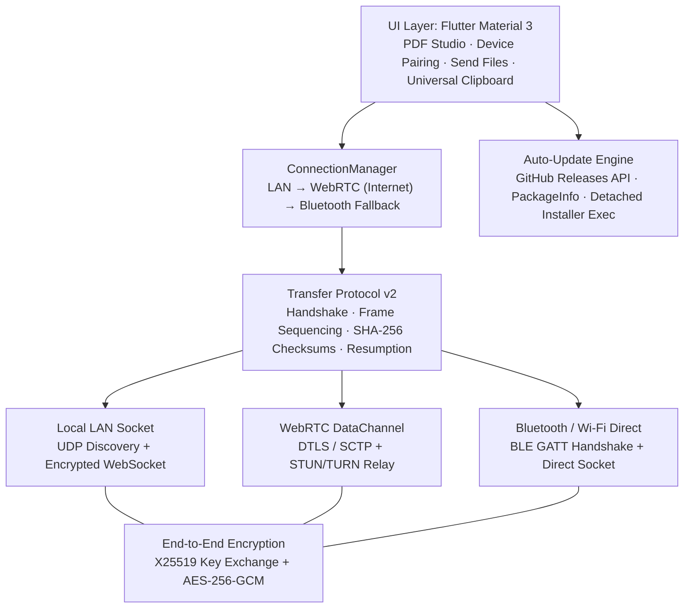

<div align="center">

# QuickShare Studio

**Cross-platform file sharing, universal clipboard and PDF studio for labs, classrooms and developers.**

[](https://github.com/abhijeetmahakur/QuickShareStudio/actions/workflows/ci.yml)
[](https://github.com/abhijeetmahakur/QuickShareStudio/actions/workflows/release.yml)
[](https://github.com/abhijeetmahakur/QuickShareStudio/releases/latest)
[](LICENSE)
[](https://flutter.dev)

[Download](#-download--install) · [Features](#-features) · [Auto-Updates](#-auto-updates--releases) · [Build from source](#-build-from-source) · [Architecture](#-architecture) · [Contributing](#-contributing)


</div>

---

## 📖 Overview

**QuickShare Studio** turns a pile of screenshots into a clean, print-ready PDF in a few clicks, and provides all the tools around it: lossless merging, splitting, and compressing PDFs, a universal clipboard, and zero-configuration device pairing via QR code or a 6-digit session pin.

**No account, no sign-in, and no cloud storage required:** files go directly between devices with end-to-end encryption across the same Wi-Fi, over the internet (WebRTC with automatic TURN relay fallback), or via Bluetooth.

---

## ✨ Features

| Area | What you get |
|---|---|
| **PDF Studio** | Three-panel live workspace (pages · real-time preview · layout presets) supporting 1, 2, 3, 4, 6, 8, and 10 images per page or custom grid layouts; A3, A4, A5, and Letter paper sizes; printer-safe margins; custom borders, captions, headers/footers, and page numbers. Work is preserved across navigation tabs. |
| **PDF Tools** | Lossless merge and split (pages are copied directly so text stays selectable and file sizes stay minimal); compression (72 / 100 / 150 DPI JPEG profiles); OCR for screenshots and scanned documents (English and Hindi) with text extraction and searchable PDF output; multi-format batch file converter. |
| **Save, Print & Share** | Exports directly to `Downloads/QuickShare`; *Print / Preview* triggers the native OS print engine; *Share* opens the system share sheet. |
| **Device Pairing** | One unified 6-digit code or QR code handles 3 transport layers: **Local Wi-Fi (LAN)**, **Internet (WebRTC P2P with TURN relay)**, and **Bluetooth (Android 10+)**. Codes expire after 5 minutes and require receiver confirmation. |
| **Fast File Transfers** | Transfer multiple files of any size with end-to-end encryption (X25519 + AES-256-GCM). Features interactive progress bars, live transfer speed, ETA, connection resumption on network drops, and SHA-256 cryptographic verification for every file. |
| **Universal Clipboard** | Sync text, code snippets, URLs, and clipboard images between devices with preview verification before transmission. |
| **Screenshot Sessions** | Group screenshots by experiment, lecture, or project with automatic duplicate detection and drag-and-drop reordering. |
| **Native Windows Shell** | Fully embedded custom application icon in `.exe`, desktop shortcuts, Start Menu, taskbar, and top-left title bar (`WM_SETICON`). |
| **In-App Auto-Updates** | Checks GitHub Releases on launch and every 4 hours while running. Displays an update prompt with release notes, downloads the new installer/package with progress indicator, and applies the update smoothly. |

> **100% Offline Capability:** PDF editing, OCR extraction, printing, local Wi-Fi transfers, and Bluetooth sharing require zero internet connection. The internet is only used for remote WebRTC connections and release checks.

---

## 📥 Download & Install

Pre-compiled packages and installers are published on the **[Releases Page](https://github.com/abhijeetmahakur/QuickShareStudio/releases/latest)**.

| Platform | Package | Description |
|---|---|---|
| 🪟 **Windows 10/11** | `QuickShareStudio-Windows-Setup.exe`<br>`QuickShareStudio-Windows-x64.zip` | Native Windows installer with Start Menu/Desktop shortcuts, or portable release zip bundle. |
| 🤖 **Android** | `QuickShareStudio-Android.apk` | Native APK with background transfer service and camera QR scanner. |
| 🐧 **Linux** (x64) | `QuickShareStudio-Linux.tar.gz` | Portable Linux bundle with desktop launcher script. |
| 🍎 **macOS / iOS** | Build from source | Xcode build target for macOS and iPhone/iPad. |
| 🌐 **Web / PWA** | Web browser / PWA | Installable Progressive Web App via Chrome, Edge, or Safari. |

---

### 🪟 Windows Installation

#### Option 1: Installer (Recommended)
1. Download **`QuickShareStudio-Windows-Setup.exe`** from the [latest release](https://github.com/abhijeetmahakur/QuickShareStudio/releases/latest).
2. Run the setup wizard. It installs QuickShare Studio into your user programs directory, creates Desktop & Start Menu shortcuts with the custom app icon, and registers the app in Windows Settings.

#### Option 2: Portable Zip
1. Download **`QuickShareStudio-Windows-x64.zip`** from the [latest release](https://github.com/abhijeetmahakur/QuickShareStudio/releases/latest).
2. Extract the archive into your preferred directory (e.g., `C:\Apps\QuickShareStudio`).
3. Launch `quickshare.exe`.

---

### 🤖 Android Installation

1. Open the [latest release](https://github.com/abhijeetmahakur/QuickShareStudio/releases/latest) on your mobile device.
2. Download **`QuickShareStudio-Android.apk`**.
3. Open the APK. If prompted, grant permission to install unknown apps for your browser or file manager (*Settings → Apps → Special app access → Install unknown apps*).
4. Tap **Install** and open the application.

---

### 🐧 Linux Installation

```bash
# 1. Download and extract the latest Linux package
wget https://github.com/abhijeetmahakur/QuickShareStudio/releases/latest/download/QuickShareStudio-Linux.tar.gz
tar -xzf QuickShareStudio-Linux.tar.gz
cd QuickShareStudio-Linux

# 2. Launch
./launch.sh
```

---

## 🔄 Auto-Updates & Releases

QuickShare Studio includes a built-in auto-update engine powered by GitHub Releases.

### How Updates Work in the App
1. **Single Source of Truth**: The application version is defined directly in [`pubspec.yaml`](pubspec.yaml) and read dynamically via `package_info_plus`.
2. **Detection**: The app queries `https://api.github.com/repos/abhijeetmahakur/QuickShareStudio/releases/latest` on startup and every 4 hours while running.
3. **Interactive Dialog**: If a newer version is published, an **Update available** popup shows the new tag version, release notes, and options:
   - **Update Now**: Streams the download with a progress bar, verifies package checksums, launches the Windows installer in detached mode, and closes the app to apply the upgrade.
   - **Update Later**: Postpones the prompt so your workflow is never interrupted.
4. **Resilient**: Network drops and API rate limits are handled completely silently without throwing errors or interrupting offline features.

### Releasing a New Version (For Developers)

Releases are built, packaged, and published automatically via GitHub Actions ([`.github/workflows/release.yml`](.github/workflows/release.yml)):

```bash
# 1. Bump version in pubspec.yaml (e.g., version: 2.0.2+202) and update CHANGELOG.md
# 2. Commit the changes
git add pubspec.yaml CHANGELOG.md
git commit -m "Release v2.0.2"

# 3. Tag and push
git tag v2.0.2
git push origin main --tags
```

The GitHub Actions CI/CD pipeline runs on `windows-latest` and `ubuntu-latest`:
- Compiles the native Windows release (`flutter build windows --release`).
- Packages `QuickShareStudio-Windows-x64.zip`.
- Builds the Inno Setup installer (`QuickShareStudio-Windows-Setup.exe`).
- Builds `QuickShareStudio-Android.apk`.
- Generates `latest.json` and `SHA256SUMS.txt`.
- Attaches all assets to the new GitHub Release tag.

---

## 🔗 Connecting Devices

On the receiving device, open **Device Pairing** to view a 6-digit code and QR code (valid for 5 minutes). On the sending device, open **Device Pairing → Connect to another device**, scan the QR code or type the pin, and tap **Pair / Connect**:

1. **Local Wi-Fi:** QuickShare discovers devices on your local subnet first via UDP beacon and WebSocket handshake.
2. **Internet:** If devices are on different networks (mobile data vs home broadband), the connection seamlessly falls back to WebRTC data channels with STUN/TURN relays.
3. **Bluetooth:** When offline without any shared network, devices pair over Bluetooth Low Energy (BLE) and transfer data over Wi-Fi Direct.

---

## 🛠 Build from Source

### Prerequisites
- [Flutter SDK 3.47+](https://docs.flutter.dev/get-started/install) (Dart 3.13+)
- Git
- For Windows native build: Visual Studio 2022 with C++ desktop workload
- For Android: Android SDK (Platform 34+, NDK 28)

### Building Locally

```bash
# Clone the repository
git clone https://github.com/abhijeetmahakur/QuickShareStudio.git
cd QuickShareStudio

# Fetch dependencies
flutter pub get

# Build native Windows desktop release
flutter build windows --release

# Build Android APK
flutter build apk --release

# Run tests
flutter test
```

> [!TIP]
> **Windows Developer Mode**: Building Flutter Windows apps with plugins requires unprivileged symbolic link support. If prompted, open Windows Developer Settings by running `start ms-settings:developers` in Run (`Win + R`) and toggle **Developer Mode** to **On**.

---

## 🧼 Clearing Windows Icon Cache

If Windows Explorer displays an older cached icon on shortcuts or `.exe` files after rebuilding:

```cmd
ie4uinit.exe -show
```

Or run the full explorer cache reset in PowerShell:
```powershell
taskkill /f /im explorer.exe
Remove-Item "$env:LOCALAPPDATA\IconCache.db" -Force -ErrorAction SilentlyContinue
Remove-Item "$env:LOCALAPPDATA\Microsoft\Windows\Explorer\iconcache*" -Force -ErrorAction SilentlyContinue
start explorer.exe
```

---

## 🧱 Architecture



| Layer | Implementation |
|---|---|
| **UI & Styling** | Flutter Material 3, custom Glassmorphism tokens, and responsive multi-window layouts. |
| **State Management** | `provider` (`TransferEngine`, `ConnectionManager`, `AppUpdateService`, `ThemeService`). |
| **Transfer Protocol** | `lib/transfer/protocol/`: streaming byte framing, incremental SHA-256 verification, and automatic transfer resumption. |
| **Networking** | LAN (`shelf`, WebSockets), Internet (`flutter_webrtc`, PeerJS signaling, TURN relays), Bluetooth (`BluetoothBridge`). |
| **Cryptography** | `cryptography` (X25519 ECDH, HKDF, AES-256-GCM authenticated encryption). |
| **Native Windows Runner** | C++ Win32 runner with `WNDCLASSEX`, `WM_SETICON`, and Visual Studio `Runner.rc` resource embedding. |
| **PDF Engine** | `pdf`, `printing`, PDF.js, and client-side OCR extraction. |

---

## 🤝 Contributing

1. Fork the repository and create a feature branch: `git checkout -b feature/my-feature`.
2. Ensure code compiles and all tests pass: `flutter test`.
3. Commit your changes and submit a pull request with details on what you modified.

Bug reports and feature suggestions are welcome under [GitHub Issues](https://github.com/abhijeetmahakur/QuickShareStudio/issues).

---

## 📄 License

This project is licensed under the [MIT License](LICENSE). © 2026 Abhijeet Mahakur.
